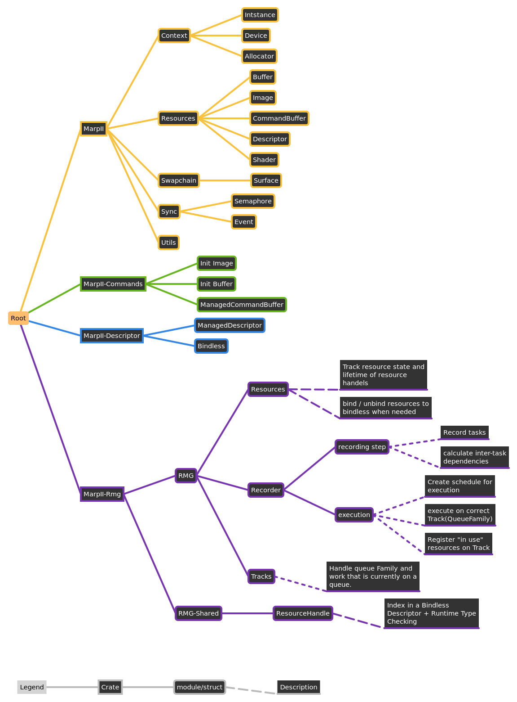

# MarpII

Second iteration of [marp](gitlab.com/tendsinmende/marp). Vulkan wrapper around the [ash](crates.io/crates/ash) crate. Focuses on stable resource creation and usability. Tries to minimized duplication between ash and itself.

## Difference to Marp
Marp tries to wrap the Ash crate. The target was to create a high-level-ish API that allows faster iterations while programming without sacrificing speed of the resulting application.

This works for simple applications, like [algae's test application](https://gitlab.com/tendsinmende/algae/-/tree/main/crates/vulkan_runner) but became limiting when writing bigger applications like [nako's renderer](https://gitlab.com/tendsinmende/nako/-/tree/main/crates/nakorender).

More sophisticated applications sometimes need to create more complex systems that need access to Vulkan's low level primitives. This is where MarpII shines. It provides helpful helpers that can, but don't have to be used.

The main [marpii](crates/marpii) crate provides helper function for the most common vulkan objects like pipelines, images, buffers etc. It manages lifetimes of objects that are created through the device. This usually happens "on drop" of those resources. Additionally, some implicit lifetime tracking (for instance command-pools must outlive the command buffer created from those pools) are implemented by keeping a reference to the pool until the command buffer is dropped.

## Defaults and opinionated design

MarpII has some design decisions that are opinionated. For instance, where ever it matters the target vulkan version will be the latest stable major release. As of writing (march 2022) this is 1.3. It also uses `Arc<T>` to keep objects alive. The added safety/convenience is payed by some overhead.

## Getting started

### Library usage

Usage of the library is as usual by including the crate in your `Cargo.toml`.
Examples can be found in the `examples` directory, marpii is also documented. A simple `cargo doc --open` should provide you with the necessary documentation.

### Helpers

Apart from the main crate that is closely related to Vulkan multiple helper crates exist that should make working with vulkan easier. Have a look at their READMEs for a description on what they do and how experimental they are.

- marpii-commands: CommandBuffer helper that captures resources that are needed for the execution of the command buffer.
- marpii-rmg: Frame-graph helper. Allows defining multiple sub `Task`s for a frame. Takes care of resources (Buffers/Images), layout and access transitions, pipeline barriers, inter-queue synchronisation etc. You basically only have to register which resources are used for a task, and how the draw/dispatch is done. 
- marpii-rmg-shared: `no_std` crate that defines the resource handles used by RMG's bindless setup. Can be used in rust-gpu based shaders for convenient access.
- marpii-descriptor: Multiple `DescriptorSet` helpers. Similar to the command-buffer helper resources are captured to keep the descriptor sets valid. Also handles descriptor allocation and freeing for you.

### Examples

Examples are executed via `cargo run --bin example_name`. Have a look at `examples/` for available applications.

## Crates structure

## Dependencies
A list of dependencies used in the crates of this project. Have a look at the `Cargo.toml` of each crate for further information about features and versions.

### MarpII

- ash: general vulkan API bindings
- ash-window: convenient abstraction over window handles. Allows for a generic implementation of `Surface` without having to handle multiple window crates.
- raw-window-handle: used to be able to expose the window handle needed for `Surface`
- anyhow: convenient error handling. Otherwise we'd have either one really big error ENum, or multiple small ones. Either way, there are a lot of different error states that are not really recoverable. So a simple string like error is enough in most cases.
- const-cstr: Allows defining constant CStrings. They are used for default messages in the debug callback. 
- small-vec: Whenever only small collections are needed this allows us to uses arrays in the general case and Vecs if those are not big enough.
- ahash: in the cases where we need a hash map/set ahash is used for speed.
- gpu-allocator: standard Vulkan memory allocator
- log: logging if enabled
- puffin: profiling if enabled
- rspirv-reflect: spirv-module reflection if enabled. Allows convenient descriptor-layout creation.

### MarpII-Rmg

- marpii/marpii-commands/marpii-descriptor: marpii binding
- anyhow: convenient error handling
- thiserror: convenient error handling
- ahash: in the cases where we need a hash map/set ahash is used for speed.
- slotmap: Fast and safe Vec-like mapping from handles to internal resource
- log: logging if enabled
- winit: swapchain handling
- crossbeam-channel: async resource collector (not yet implemented)
- poll-promise: async resource collector (not yet implemented)

### MarpII-Commands
- marpii: marpii binding
- anyhow: convenient error handling.
- log: logging if enabled

### MarpII-Descriptor

- marpii: marpii binding
- anyhow: convenient error handling.
- ahash: in the cases where we need a hash map/set ahash is used for speed.
- log: logging if enabled

## Contributing

You are welcome to contribute. All contributions are licensed under the MPL v2.0.

Note that the project is currently in its early stages. Actual contribution might be difficult.

## License

The whole project is licensed under MPL v2.0, all contributions will be licensed the same. Have a look at Mozilla's [FAQ](https://www.mozilla.org/en-US/MPL/2.0/FAQ/) to see if this fits your use-case.
