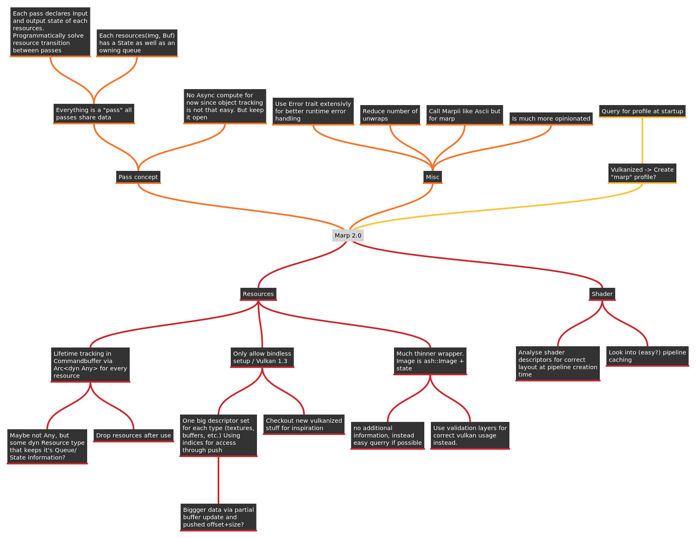

# MarpII

Second iteration of [marp](gitlab.com/tendsinmende/marp). Vulkan wrapper around the [ash](crates.io/crates/ash) crate. Focuses on stable resource creation and usability. Tries to minimized duplication between ash and itself.

## Difference to Marp
Marp tries to wrap the Ash crate completely. The target was to create a high-level-ish API that allows faster iterations while programming without sacrificing speed of the resulting application.

This works for simple applications, like [algae's test application](https://gitlab.com/tendsinmende/algae/-/tree/main/crates/vulkan_runner) but became limiting when writing bigger applications like [nako's renderer](https://gitlab.com/tendsinmende/nako/-/tree/main/crates/nakorender).

More sophisticated applications sometimes need to create more complex systems that need access to Vulkan's low level primitives. This is where MarpII shines. It provides helpful helpers that can, but must not be used.

The main [marpii](crates/marpii) crate provides helper function for the most common vulkan objects like pipelines, images, buffers etc. If manages lifetimes of objects that are created through the device. This usually happens "on drop" of those ressources. Additionaly some implicit lifetime tracking (for instance command-pools must outlive the command buffer created from those pools) are implemented by keeping a reference to the pool until the command buffer is dropped.

On top of those low-level-ish helpers higher level helpers are implemented. Most notably:

- marpii-descriptor: Self growing descriptor pool with descriptor sets that keep their bound resources alive until they are dropped.
- marpii-command: Command-buffer helper that keeps resources alive until the command buffer is not in use anymore. 
- marpii-command-graph: Provides highlevel "pass" abstraction and resource state tracking. Allows easy combination of graphics/renderpasses for rapid rendering prototyping.

Have a look at the [minder](https://flathub.org/apps/details/com.github.phase1geo.minder) mind map for the initial ideas.

## Defaults and opinionated design

MarpII has some design decisions that are opinionated. For instance, where ever it matters the target vulkan version will be the latest stable major release. As of writing (march 2022) this is 1.3 

## Getting started

### Library usage

Usage of the library is as usual by including the crate in your `Cargo.toml`.
Examples can be found in the `examples` directory, marpii is also documented. A simple `cargo doc --open` should provide you with the necessary documentation.

### Examples

Examples are executed via `cargo run --bin example_name`. Have a look at `examples/` for available applications.

## Roadmap
- [x] Simple device and resource creation
- [ ] RAII style resource (Image / Buffer) creation
- [ ] Bindless setup helpers
- [x] Pipeline layout <-> Shader descriptor verfication
- [ ] Resource state negotiation (allows declaring "needed" state and "current" state and the needed transition between them), for single queue environment
- [ ] high level "pass" concept with automatic inter-state transitions
- [ ] command-buffer resource attachments (for better tracking of resource lifetimes)

## Contributing

You are welcome to contribute. All contributions are licensed under the MPL v2.0.

Note that the project is currently in its early stages. Actual contribution might be difficult.

## License

The whole project is licensed under MPL v2.0, all contributions will be licensed the same. Have a look at Mozilla's [FAQ](https://www.mozilla.org/en-US/MPL/2.0/FAQ/) to see if this fits your use-case.
